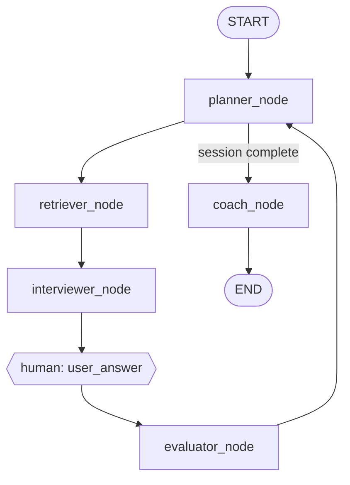

# Agent Definitions (Phase 0)

Five agents participate in the interview workflow. Each has a **single primary responsibility**; shared context lives in `InterviewState` (see [state_schema.md](./state_schema.md)).

---

## 1. Planner Agent

**Role:** Session conductor — controls interview flow, difficulty, round type, and when to stop.

| Attribute | Value |
|-----------|-------|
| **Inputs** | `InterviewState` (role, history, latest scores, skill_signals) |
| **Outputs** | `current_round`, `round_type`, `difficulty`, `topic`, `session_status` |
| **Tools** | None (pure policy + optional LLM for routing) |
| **LLM use** | Optional for complex topic routing (Phase 7); rule-based MVP in Phase 5 |

**Responsibilities**

- Initialize session from target role (and optional `target_job_id`)
- After each evaluation: decide next round vs end session
- Phase 7: weaken difficulty after low scores; increase after strong scores; bias weak topics

**Routing rules (Phase 7 baseline)**

| Condition | Action |
|-----------|--------|
| `total_score < 5` | Decrease difficulty one level (min `easy`) |
| `total_score >= 8` | Increase difficulty one level (max `hard`) |
| Topic score &lt; 6 in `skill_signals` | Next round same `topic`, `round_type` aligned |
| `current_round >= max_rounds` | `session_status = completed` |

---

## 2. Retriever Agent

**Role:** Fetch grounded context from the knowledge base.

| Attribute | Value |
|-----------|-------|
| **Inputs** | Query string, `collection`, optional metadata filters |
| **Outputs** | `retrieved_context: list[ContextChunk]` |
| **Tools** | `search_jobs`, `search_questions`, `search_technical_docs` (thin wrappers over RAG) |
| **LLM use** | Multi-query expansion only when `RAG_USE_MULTI_QUERY=true` (Phase 3) |

**Collection selection**

| `round_type` | Primary collection | Secondary |
|--------------|-------------------|-----------|
| `theory`, `ml` | `interview_questions` | `technical_docs` |
| `coding`, `dsa`, `oop` | `interview_questions` | `technical_docs` |
| `system_design` | `technical_docs` | `job_descriptions` |
| `behavioral` | `job_descriptions` | `interview_questions` |

**Filters:** `role`, `topic`, `difficulty` from Planner output.

---

## 3. Interviewer Agent

**Role:** Produce the question (and optional follow-up) shown to the candidate.

| Attribute | Value |
|-----------|-------|
| **Inputs** | `InterviewState` + `retrieved_context` |
| **Outputs** | `question`, `expected_points`, `question_type` |
| **Tools** | `generate_question` (Phase 4 structured generator) |
| **LLM use** | Yes — must cite retrieved chunks; JSON output only |

**Constraints**

- Must not ask questions with zero retrieval above similarity threshold (fallback: generic role question + warning flag)
- Follow-ups reference `user_answer` from previous round when `is_followup=true`

---

## 4. Evaluator Agent

**Role:** Score the candidate’s answer against rubric and expected points.

| Attribute | Value |
|-----------|-------|
| **Inputs** | `question`, `expected_points`, `user_answer`, `retrieved_context` (ideal concepts) |
| **Outputs** | `EvaluationScore` JSON |
| **Tools** | `retrieve_ideal_concepts` (optional second retrieval) |
| **LLM use** | Yes — temperature 0, structured JSON |

**Rubric weights (Phase 6)**

| Dimension | Weight |
|-----------|--------|
| Correctness | 40% |
| Completeness | 25% |
| Clarity | 15% |
| Job alignment | 20% |

---

## 5. Coach Agent

**Role:** Post-round or end-of-session feedback and learning guidance.

| Attribute | Value |
|-----------|-------|
| **Inputs** | Full `history`, `skill_signals`, gap analysis (Phase 8), `retrieved_context` for resources |
| **Outputs** | `coach_feedback`, `learning_roadmap` (Phase 9) |
| **Tools** | `search_technical_docs` for resource links |
| **LLM use** | Yes — after session or on demand |

**When it runs**

- **Not** in the critical path every round (avoids latency)
- Triggered when `session_status == completed` or user requests “coach mode”

---

## Graph topology (LangGraph)

**Node ownership**

| Node | Agent |
|------|-------|
| `planner_node` | Planner |
| `retriever_node` | Retriever |
| `interviewer_node` | Interviewer |
| `evaluator_node` | Evaluator |
| `coach_node` | Coach |

Human input uses LangGraph `interrupt_before` on `wait_answer` (or equivalent checkpoint).

---

## Agent ↔ phase mapping

| Agent | First implemented |
|-------|-------------------|
| Retriever | Phase 2–3 (RAG); wrapped as agent Phase 5 |
| Interviewer | Phase 4 |
| Evaluator | Phase 6 |
| Planner | Phase 5 (basic), Phase 7 (adaptive) |
| Coach | Phase 9 |
