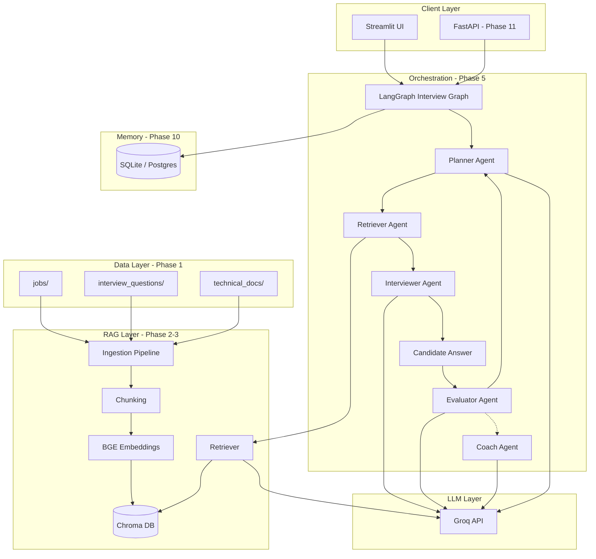
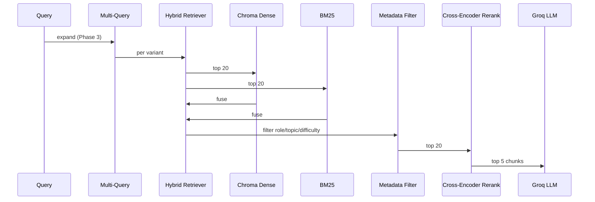
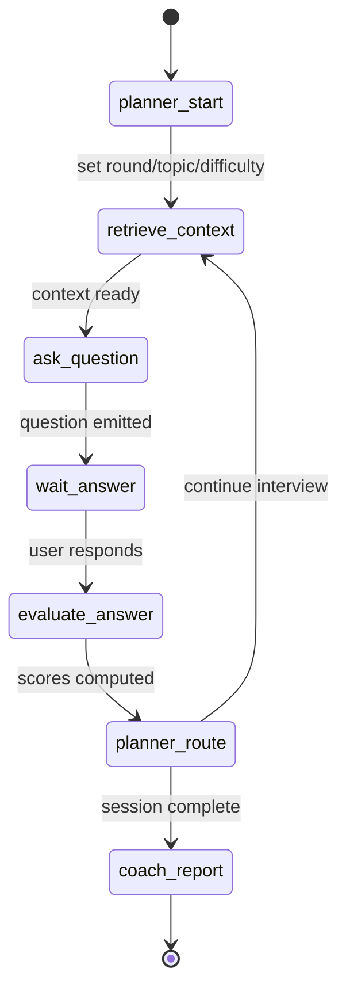

# PrepCoach — System Architecture (Phase 0)

**Agentic Interview Preparation Coach with RAG**

Version: 0.1 · Status: Phase 0 baseline · Canonical root: `agentic-interview-coach/`

---

## 1. Vision

PrepCoach runs **grounded, adaptive mock interviews** for ML/AI/SWE roles. Answers are retrieved from curated job descriptions, interview questions, and technical documentation—not invented from model weights alone. A **LangGraph multi-agent workflow** orchestrates planning, questioning, retrieval, evaluation, and coaching.

---

## 2. High-level architecture



---

## 3. Technology stack

| Layer | Choice | Notes |
|-------|--------|-------|
| **LLM (dev)** | Groq API | `llama-3.3-70b-versatile` primary; `qwen-qwq-32b` fallback via env |
| **Embeddings** | `BAAI/bge-base-en-v1.5` | Local via `sentence-transformers` / LangChain HuggingFace |
| **Vector DB** | Chroma | 3 collections: `job_descriptions`, `interview_questions`, `technical_docs` |
| **Agent framework** | LangGraph | Phase 5+ |
| **LLM framework** | LangChain | Groq chat, embeddings, Chroma wrapper |
| **Sparse retrieval** | `rank-bm25` | Phase 3 hybrid |
| **Reranker** | `cross-encoder/ms-marco-MiniLM-L-6-v2` | Phase 3 |
| **Frontend** | Streamlit | Phase 4–7 demo UI |
| **Backend (later)** | FastAPI | Phase 11 |
| **User DB (later)** | SQLite → PostgreSQL | Phase 10 |
| **Cache (later)** | Redis | Phase 11 |

---

## 4. RAG pipeline (target)



**Phase 2 baseline:** query → single collection (or merged) → top-k dense only.  
**Phase 3:** enable hybrid, multi-query, rerank via feature flags.

---

## 5. LangGraph interview flow (target)



See [agents.md](./agents.md) and [state_schema.md](./state_schema.md).

---

## 6. Chroma collections

| Collection | Source folder | Primary metadata |
|------------|---------------|------------------|
| `job_descriptions` | `data/jobs/` | `role`, `skills`, `seniority` |
| `interview_questions` | `data/interview_questions/` | `topic`, `difficulty`, `question_type` |
| `technical_docs` | `data/technical_docs/` | `topic`, `source`, `license` |

---

## 7. Configuration

Environment variables (see `.env.example`):

- `GROQ_API_KEY` — required for LLM
- `LLM_MODEL` — default `llama-3.3-70b-versatile`
- `LLM_MODEL_FALLBACK` — optional `qwen-qwq-32b`
- `CHUNK_SIZE` / `CHUNK_OVERLAP` — default 700 / 150
- `RAG_USE_HYBRID`, `RAG_USE_MULTI_QUERY`, `RAG_USE_RERANK` — feature flags

---

## 8. Repository layout

Canonical project root is **`agentic-interview-coach/`**. Parent `PrepCoach/` may hold legacy data; migrate into `data/` here during Phase 1.

```
agentic-interview-coach/
├── docs/                 # Phase 0 architecture & plans
├── schemas/              # JSON Schema contracts
├── data/                 # Phase 1 datasets
├── app/
│   ├── config.py
│   ├── schemas/          # Pydantic mirrors of contracts
│   ├── ingestion/
│   ├── rag/
│   ├── generation/       # Phase 4
│   ├── agents/           # Phase 5 LangGraph
│   ├── evaluation/       # Phase 6
│   ├── coaching/         # Phase 8-9
│   ├── memory/           # Phase 10
│   ├── api/              # Phase 11
│   ├── llm/
│   └── ui/
├── scripts/              # ingest, validate, eval
├── tests/
├── vectorstore/          # Chroma persist (gitignored)
├── requirements.txt
└── .env.example
```

---

## 9. Phase dependencies

| Phase | Depends on | Delivers |
|-------|------------|----------|
| 0 | — | This document, schemas, structure |
| 1 | 0 | Normalized `data/` |
| 2 | 1 | Core RAG + 3 collections |
| 3 | 2 | Hybrid retrieval |
| 4 | 2–3 | JSON question generation |
| 5 | 4 | LangGraph workflow |
| 6 | 5 | Evaluator + rubric |
| 7 | 6 | Adaptive planner |
| 8 | 6, 1 | Skill gap report |
| 9 | 8 | Coaching plan |
| 10 | 5–9 | User persistence |
| 11 | 10 | Deploy |

---

## 10. Non-goals (Phase 0)

- Production deployment, auth, billing
- Live coding sandbox (describe-approach mode only until later)
- Scraping LinkedIn/Wellfound (use public datasets + curated data)

---

## 11. References

- [agents.md](./agents.md)
- [data_schema.md](./data_schema.md)
- [state_schema.md](./state_schema.md)
- [implementation_plan.md](./implementation_plan.md)
