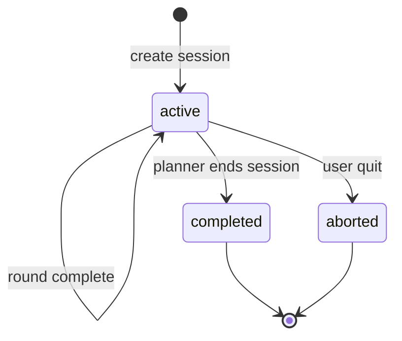

# Interview State Schema (Phase 0)

Canonical runtime state for LangGraph (Phase 5+). Implemented as Pydantic models in `app/schemas/interview_state.py`.

---

## 1. `InterviewState` (graph state)

| Field | Type | Description |
|-------|------|-------------|
| `session_id` | string | UUID for session |
| `user_id` | string \| null | Phase 10; null for anonymous |
| `role` | RoleCode | Target role code |
| `target_job_id` | string \| null | Optional specific JD |
| `session_status` | enum | `active`, `completed`, `aborted` |
| `current_round` | int | 1-based round index |
| `max_rounds` | int | Default 5–10 |
| `round_type` | RoundType | Current question category |
| `difficulty` | Difficulty | `easy`, `medium`, `hard` |
| `topic` | Topic \| null | Current topic focus |
| `question` | string \| null | Current question text |
| `expected_points` | string[] | Rubric for evaluator |
| `user_answer` | string \| null | Latest candidate answer |
| `retrieved_context` | ContextChunk[] | Chunks for current round |
| `scores` | EvaluationScore \| null | Latest round scores |
| `history` | RoundRecord[] | Completed rounds |
| `skill_signals` | dict[str, float] | Rolling topic/skill scores |
| `coach_feedback` | string \| null | Set by Coach agent |
| `flags` | dict | e.g. `low_retrieval`, `is_followup` |

---

## 2. Enums

**RoleCode:** `MLE`, `AI`, `DS`, `SWE`, `GENAI`

**RoundType:** `ml`, `theory`, `coding`, `system_design`, `dsa`, `oop`, `behavioral`, `swe`

**Difficulty:** `easy`, `medium`, `hard`

**SessionStatus:** `active`, `completed`, `aborted`

**Topic:** same as data schema topics (`ml`, `ml_theory`, … `agents`)

---

## 3. `ContextChunk`

| Field | Type | Description |
|-------|------|-------------|
| `content` | string | Chunk text |
| `collection` | string | Chroma collection name |
| `doc_id` | string | Parent document id |
| `score` | float | Retrieval score |
| `metadata` | dict | Full metadata passthrough |

---

## 4. `RoundRecord`

| Field | Type | Description |
|-------|------|-------------|
| `round` | int | Round number |
| `round_type` | RoundType | |
| `topic` | string \| null | |
| `difficulty` | Difficulty | |
| `question` | string | |
| `user_answer` | string | |
| `expected_points` | string[] | |
| `scores` | EvaluationScore | |
| `retrieved_doc_ids` | string[] | Provenance |

---

## 5. `EvaluationScore`

| Field | Type | Range | Weight |
|-------|------|-------|--------|
| `correctness` | float | 0–10 | 40% |
| `completeness` | float | 0–10 | 25% |
| `clarity` | float | 0–10 | 15% |
| `alignment` | float | 0–10 | 20% |
| `total` | float | 0–10 | weighted mean |
| `feedback` | string | — | Short narrative |

**Total formula**

```
total = 0.4 * correctness + 0.25 * completeness + 0.15 * clarity + 0.2 * alignment
```

---

## 6. State transitions



**Per-round update**

1. Planner sets `round_type`, `difficulty`, `topic`
2. Retriever fills `retrieved_context`
3. Interviewer sets `question`, `expected_points`
4. User fills `user_answer` (interrupt)
5. Evaluator sets `scores`; append `RoundRecord` to `history`; update `skill_signals`
6. Planner increments `current_round` or sets `session_status`

---

## 7. `skill_signals` (Phase 7–8)

Rolling average per topic key, e.g.:

```json
{
  "rag": 7.2,
  "system_design": 5.1,
  "python": 8.0
}
```

Updated after each evaluation:  
`skill_signals[topic] = 0.7 * old + 0.3 * scores.total`

---

## 8. Persistence mapping (Phase 10)

| State field | DB table |
|-------------|----------|
| `session_id`, `user_id`, `role`, `session_status` | `sessions` |
| `history[]` | `rounds` |
| `skill_signals` | `skill_snapshots` (end of session) |

Chroma remains separate from user PII.
